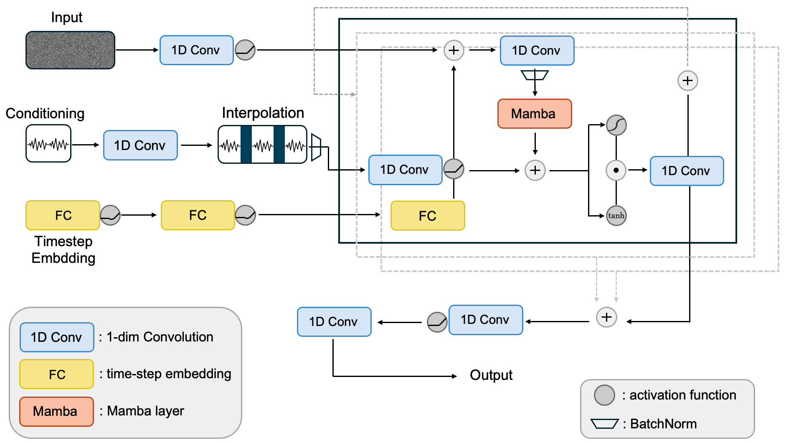

# MambaWave: Neural Raw Audio Upsampling with Mamba and Diffusion Models

Welcome to the **MambaWave** repository. 
MambaWave is a project for the DLAI course at Sapienza University of Rome. It is the first work combining Diffusion Models with Mamba 🐍 for Neural Audio Upsampling task. The project will be extended in the future, stay tuned 👀.

### Architecture of the model

The architecture of MambaWave draws ispiration from DiffWave. It implements one Mamba layer to exploit the capability of SSMs to operate on long sequences.

### Structure of the repo
The two most important files are:
* *DiffWave_simone3.py*: this file contains the code for the MambaWave model.
* *Train_AudioMamba3.py*: this file contains the code to train the model.

Then, *listen_audios.ipynb* is a notebook to listen to the audios produced by the model, while *test_MambaWave.ipynb* is the notebook used to test the results of the model (contained in the two .csv files).

Finally, you can find a brief introduction to Mamba, Diffusion Models and MambaWave in the file *MambaWave.pdf*.
